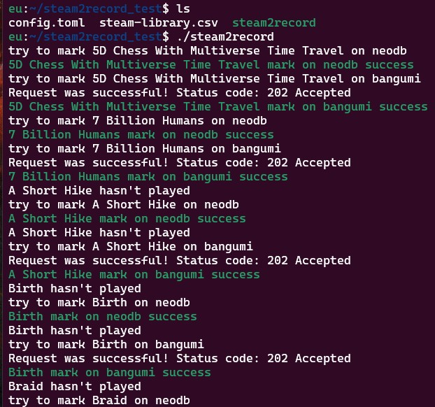

# STEAM2RECORD

## 使用
1. 使用[Steam library filters](https://www.lorenzostanco.com/lab/steam/)获取csv文件
2. 重命名为`steam-library.csv`
3. 修改`config.toml.example`为对应的配置，并重名为`config.toml`
4. `neodb_token`可参考[NeoDB 获取 Access Token-大大的小蜗牛](https://eallion.com/neodb_token)获取
5. `bangumi_token`在[个人令牌](https://next.bgm.tv/demo/access-token)获取
5. 运行
- 法一：自行编译，运行
    ```
    # 请确保有相关运行环境
    cargo build
    cargo run 
    ```
- 法二：使用编译好的程序,运行截图如下
  

## 说明
- 程序逻辑如下:
    1. 从csv文件中读取游戏名
    2. 搜索游戏名，选择条目中的第一条
    3. 根据游戏时间进行判断，无时间数据则判断为想玩，有时间数据则判断为玩过。
- 注意事项
    1. 搜索结果可能不准确
    2. 根据游戏时间判断可能不合理。
    3. 如对以上结果感到介意，请在程序运行结束后检查结果，确保其准确性
    4. 默认将标记结果设为公开，如介意，请自行修改代码。

## 踩坑
- `failed to run custom build command for openssl-sys v0.9.60`,
    - 解决，执行以下命令:
    ```bash
    sudo apt install pkg-config
    sudo apt-get install libudev-dev
    ```
- wsl可用内存过少，导致频繁崩溃
    - 解决:
    修改`.wslconfig`,示例
    ```
    [wsl2]
    memory=4GB
    swap=4GB
    localhostForwarding=true
    ```
- no method named `json` found for `reqwest` in the current scope
    - 解决:
    修改`Cargo.toml`对应内容为：
    `reqwest = { version = "0.11", features = ["json"] }`

## todo
- [ ] 重构代码：每次循环不应都要重新判断
- [x] 支持同步到Bangumi
- [ ] 对搜索结果进行判断，降低不匹配率

## 参考链接
- [Why rust is failing to build command for openssl-sys v0.9.60 even after local installation? - Stack Overflow](https://stackoverflow.com/questions/65553557/why-rust-is-failing-to-build-command-for-openssl-sys-v0-9-60-even-after-local-in)
- [(2) Error - reqwest json response to get : rust --- (2) 错误 - reqwest json 响应获取：rust](https://www.reddit.com/r/rust/comments/gg98m0/error_reqwest_json_response_to_get/)
- [wopub/Bilibili2Bangumi: 将 Bilibili 订阅动画迁移至 Bangumi，保留原追番状态并自动点格子。](https://github.com/wopub/Bilibili2Bangumi)